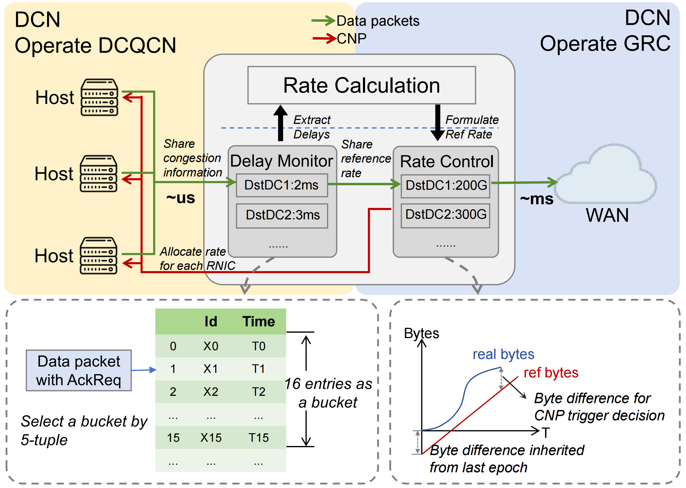

# GRC: Extending RDMA to Wide-Area Networks via Gateway-Mediated Rate Control

This repository contains the prototype for our ICNP 2026 paper, **GRC:
Extending RDMA to Wide-Area Networks via Gateway-Mediated Rate Control**.



GRC enables RDMA over shared wide-area networks by moving WAN rate control to
the gateway connecting a data center to the WAN.

## Key Features

- **Gateway-mediated control:** estimates WAN delay and maintains a reference
  rate for each destination data center.
- **Fast RNIC reaction:** translates gateway decisions into standard CNPs that
  existing RoCEv2 RNICs can process.
- **Minimal infrastructure changes:** requires gateway changes without
  RDMA-specific support in WAN devices.
- **Compatible with intra-DC transports:** WAN control is separated from the
  congestion-control mechanism used inside each data center.

## Repository Structure

- `NS3/`: complete NS-3 simulator, GRC implementation, topologies, workload
  generators, experiment runners, and analysis utilities.
- `P4/`: P4 data-plane and C control-plane source for the switch prototype.

## Quick Start

The simulator was tested on Ubuntu 20.04.

```sh
sudo apt install build-essential python3 libgtk-3-0 bzip2 python2
python3 -m pip install numpy matplotlib pandas cycler
cd NS3
./waf configure --build-profile=optimized
./waf
```

The remaining simulation commands are run from the `NS3/` directory.

Run a small GRC experiment:

```sh
python3 run.py \
  --simul_time 0.05 \
  --cdf WebSearch \
  --intra_load 30 \
  --inter_load_all 60 \
  --my_flow '' \
  --tcp_flow '' \
  --wan_cc_mode 1 \
  --msg smoke-grc
```

Each run stores its configuration and output under `mix/output/`. Use
`python3 check.py state` to inspect running and recently completed experiments.

## Evaluation

Generate the WebSearch inputs for the main load sweep:

```sh
for d in 0 60 120 180; do
  python3 config/large_traffic_gen.py -f w -b 150 -d "$d"
done
```

The overall runner is kept in the simulator tree. Inspect or launch the sweep
from `NS3/`:

```sh
cd NS3
python3 expr-overall/autorun.py --dry_run --sleep 0
python3 expr-overall/autorun.py --sleep 1
```

The generator is randomized, so regenerated inputs may differ between runs.
Experiment output is not included in this repository because of its size.

For mixed RDMA/TCP traffic, pass the included TCP input to `run.py`:

```sh
python3 run.py \
  --topo cernet_topo \
  --simul_time 0.1 \
  --my_flow w-dynamic-150-180 \
  --tcp_flow config/w-tcp-100.txt \
  --wan_cc_mode 1
```

Use `analysis/deep_analyse.py` or
`analysis/experiment_report_template.ipynb` to inspect completed runs.

## P4 Prototype

`P4/dataplane/` and `P4/controlplane/` contain the prototype source. Tofino
SDK files, SDE binaries, and hardware experiment output are not included.

## Citation

> Jue Zhang, Menghao Zhang, Zihan Niu, Bo Peng, Shucan Yang, and Xiaohe Hu.
> GRC: Extending RDMA to Wide-Area Networks via Gateway-Mediated Rate Control.
> IEEE International Conference on Network Protocols (ICNP), 2026.

```bibtex
@inproceedings{zhang2026grc,
  author    = {Jue Zhang and Menghao Zhang and Zihan Niu and Bo Peng and
               Shucan Yang and Xiaohe Hu},
  title     = {GRC: Extending RDMA to Wide-Area Networks via Gateway-Mediated Rate Control},
  booktitle = {IEEE International Conference on Network Protocols (ICNP)},
  year      = {2026}
}
```
